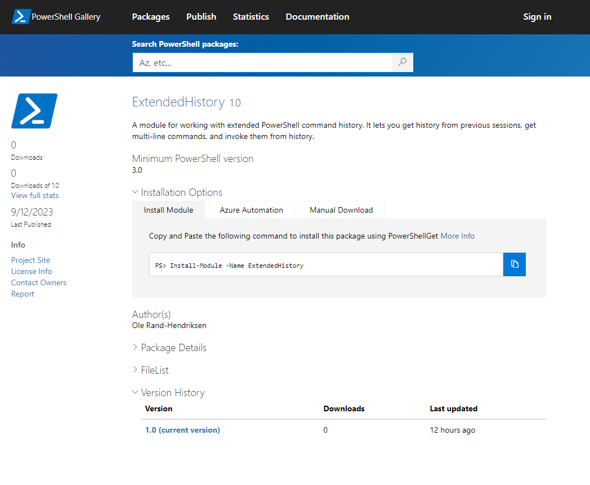

So in my previous post ([Looking up the command line history in Powershell](https://www.randriksen.net/powershell/2023/09/10/looking-up-the-command-line-history-in-powershell.html)) I wrote about my script that I use to get the command line history from PowerShell. And I mentioned that I wanted to make it into a module. Well, I did. And I've published it to the [PowerShell Gallery](https://www.powershellgallery.com/packages/ExtendedHistory/1.0). So if you want to try it out, you can install it by running 
```powershell
Install-Module -Name ExtendedHistory
``` 
in PowerShell. And if you want to see the source code, you can find it on [GitHub](https://github.com/randriksen/ExtendedHistory/)


This is the first time I've tried to make a module for publishing and that was pretty educational.

I wish I'd read a little bit more about it before I started, because there are a lot of usefull little tricks that would have made it go faster.
Like the fact that you can make a new module manifest file by running `New-ModuleManifest` and then just fill in the blanks. I didn't know that, so I made the manifest file by hand. But it would have been faster to just run the command and then edit the file.

I also found out that there are pretty nice tools out there to make sure the scripts are up to best practises and don't contain potentially harmfull code.
The [Powershell Gallery documentation](https://learn.microsoft.com/en-us/powershell/gallery/how-to/publishing-packages/publishing-a-package?view=powershellget-2.x) says that for everything you think of uploading, you have to run:
* [PowerShell Script Analyzer](https://www.powershellgallery.com/packages/PSScriptAnalyzer/), which is in the PowerShell Gallery
* For modules, `Test-ModuleManifest` which is part of PowerShell
* For scripts, `Test-ScriptFileInfo` which comes with PowerShell Get


I had a couple of things in the code that PowerShell Script Analyzer wasn't too happy about, that I corrected in the module before I published.
The worst one being that I had used `Invoke-Expression`. I ended up replacing that with:
```powershell	
$ScriptBlock = [scriptblock]::Create($hist[$i])
write-host $ScriptBlock
invoke-command -ScriptBlock $ScriptBlock
```
Which is a bit more code, but it's also a lot safer, since it doesn't just run whatever is in the history file, but it creates a scriptblock from it, and then runs that. 

Anyway, that's my first published module, and I don't plan on it being the last.